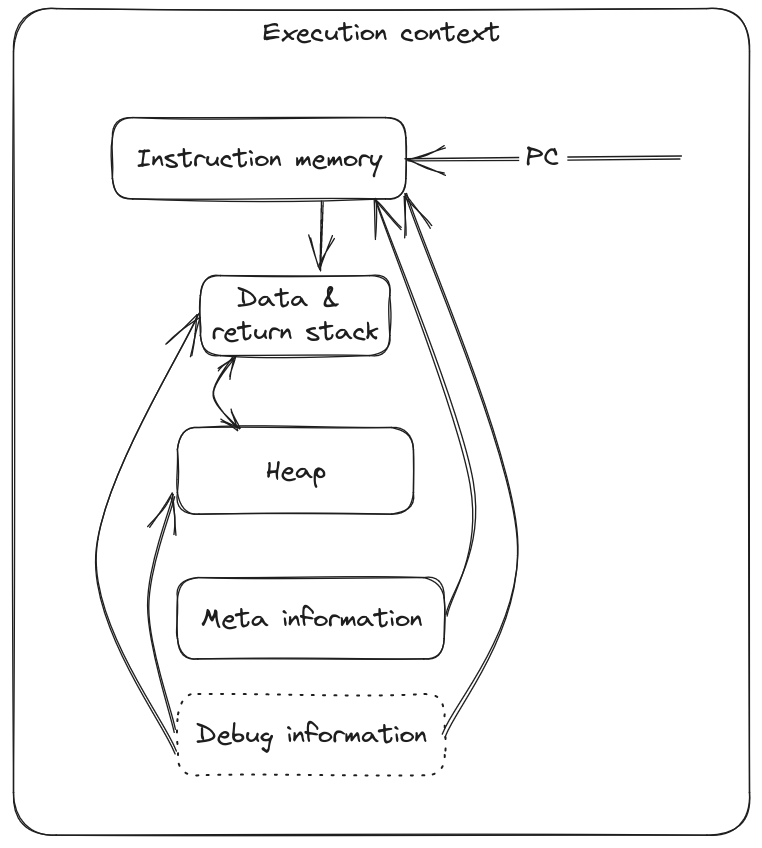

# Memory and execution model

Sahara's memory allocation and concurrency model are somewhat restrictive and opinionated. In return, the runtime is
able to guarantee memory safety, automatically manage memory, and prevent race conditions entirely. The primary concept
is the _execution context_. An execution context is an independent [green
thread](https://en.wikipedia.org/wiki/Green_thread) that is guaranteed to operate on a single operating system thread.
Instructions never span execution contexts, and data can cross between execution contexts only with explicit operations
that either copy the data or transfer its ownership to the receiving context entirely. Critically, this means that there
is _no shared heap across threads_ for any Sahara program.

An execution context can be visualized like so:

More information about each element within the execution context can be found in the [execution context
documentation](./execution-context.md).

## Context allocation

## Program execution

## Concurrency

## Scheduling